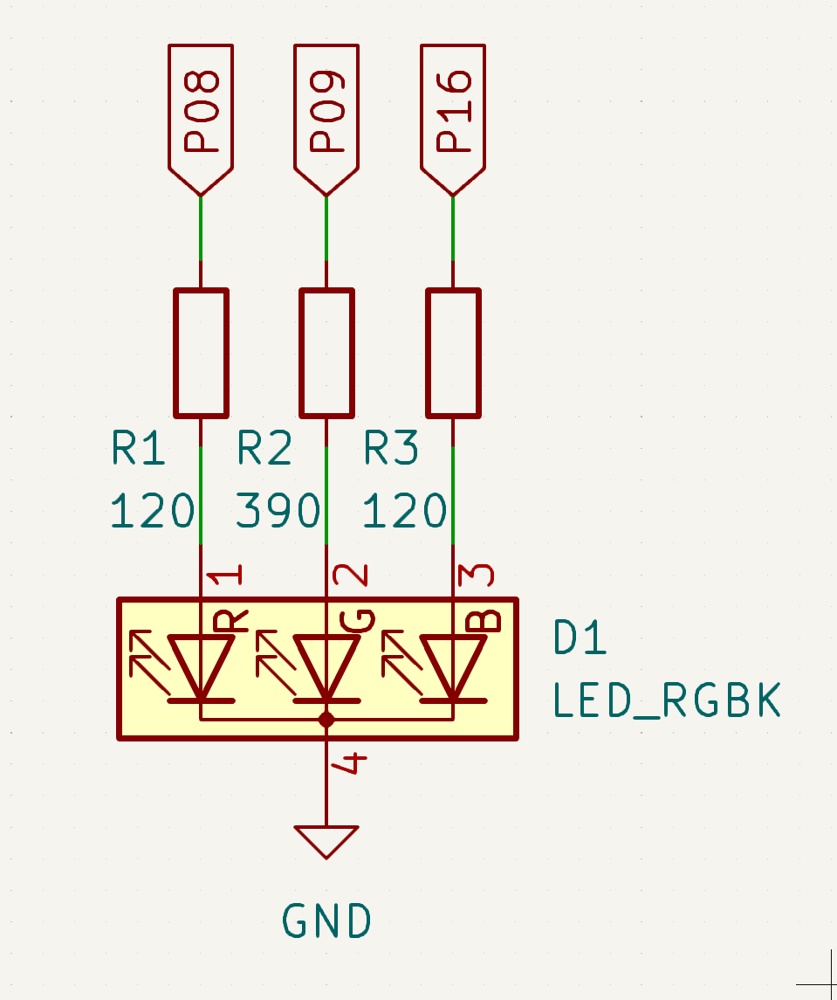
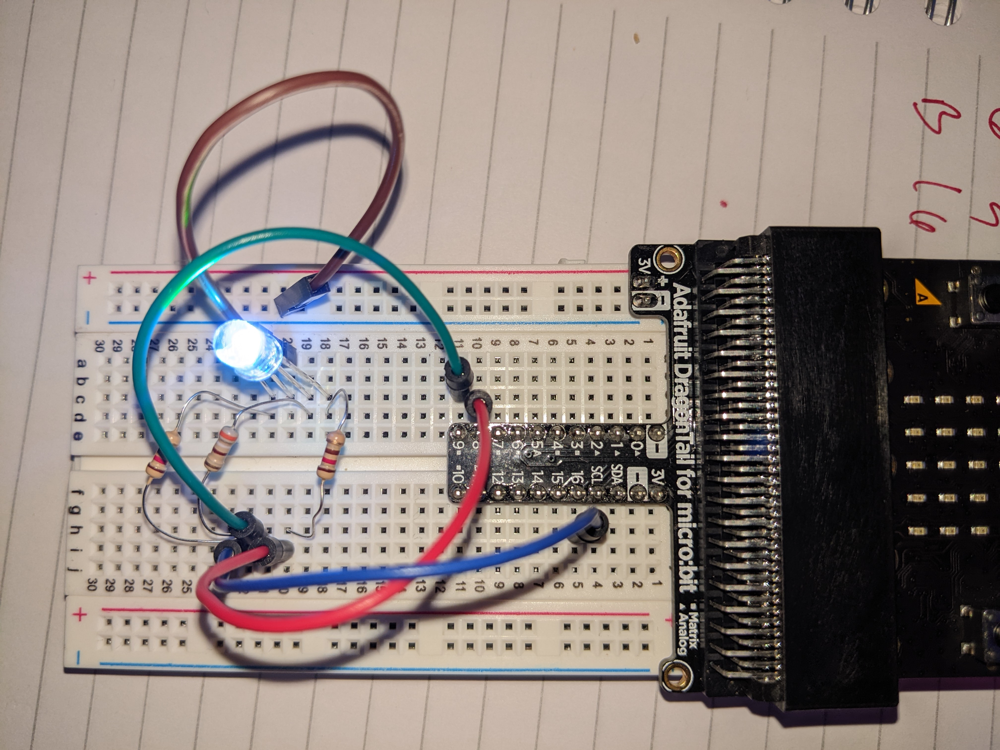

# hello-rgb: MB2 Rust external RGB demo
Bart Massey 2023

This MB2 program cycles an external RGB connected to GPIO
pins. It cycles through eight states in the order

    R, G, B, Y, C, M, W, -

at 0.5s per step.

The wires of the LED should be connected to the MB2
according to the following table. LED is the LED wire to
connect to. MB2 is the pin on the MB2 edge connector to
connect the other end of the resistor to. The anode (long
lead) of the LED should be connect to power.

    LED        MB2
    
    Red        P08
    Green      P09
    Blue       P16

The resistor values were chosen to give roughly equal
brightness to all component colors.

The schematic looks like this.

The breadboard looks like this.

# License

This work is licensed under the "MIT License". Please see the file
`LICENSE.txt` in this distribution for license terms.
